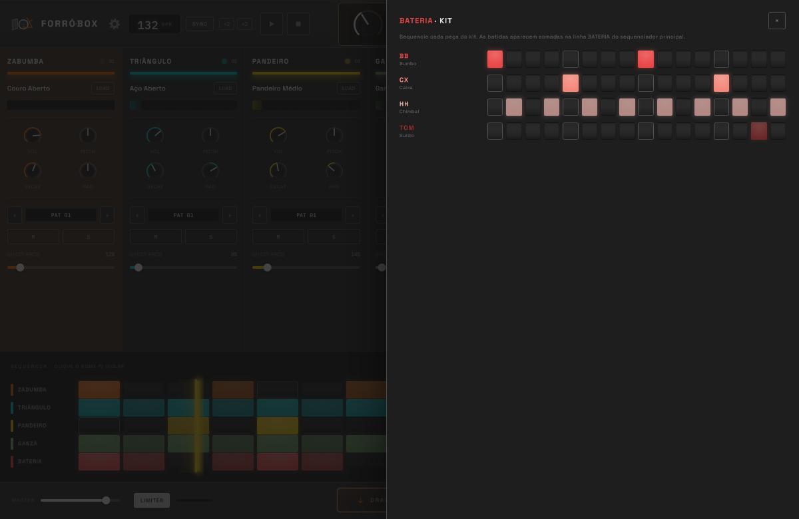
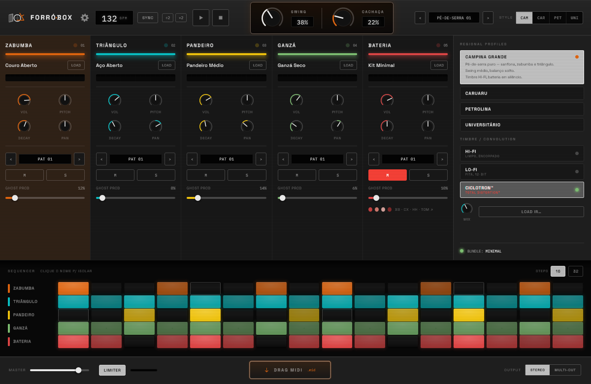
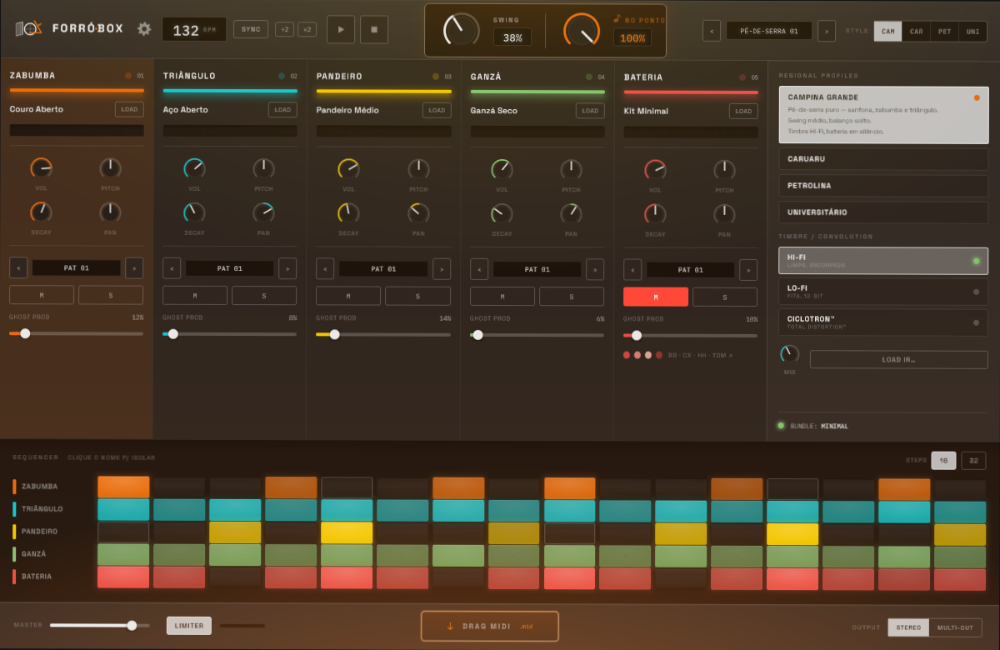

<div align="center">

# Forró Box

**A VST3 instrument for Brazilian _forró_ percussion.**

Five-channel step sequencer · four regional groove profiles · `CACHAÇA` humanisation · MIDI out

JUCE 8 · C++20 · Linux + Windows · GPLv3


</div>

---

## What it is

A drum machine for forró — the northeastern Brazilian dance music built on **zabumba**, **triângulo**
and **pandeiro**. It is a step sequencer with five instrument channels, per-step velocity, ghost
notes, swing, and a humanisation control that makes a programmed groove breathe like a played one.

The thing it is actually *for* is the last part. A forró groove that lands exactly on the grid does
not sound like forró. `CACHAÇA` is one knob that introduces timing jitter, velocity variation and
ghost notes together — and every value it produces is a **keyed hash** of `(seed, step, lane,
purpose)` rather than a draw from a random stream, so muting one channel cannot re-time another and
the same seed always gives the same performance.

### Status

**v0.1 is released** — [download it](#download) for Windows or Linux. Every row below is built:
Phase 9 closed the last four stubs — the groove bank, both cyclers, and the two file-loading
buttons. Honest breakdown:

| | |
|---|---|
| ✅ **Voices** | Eight — seven synthesised, zabumba from three measured velocity layers |
| ✅ **Sequencer** | Sample-accurate clock, swing, host sync with step 0 locked to the bar |
| ✅ **`CACHAÇA`** | Timing jitter, velocity variation, ghost notes; keyed, not drawn |
| ✅ **Output** | Character bus (HI-FI / LO-FI / CICLOTRON™), limiter, squared-taper master |
| ✅ **Multi-out** | Six VST3 buses — the full mix plus one stereo stem per channel |
| ✅ **Interface** | Full chassis, both themes, 1× / 1.5× / 2×, every control hand-drawn |
| ✅ **Grid** | Five rows, 16/32 steps with tiling, click to edit, playhead, per-channel LEDs and meters |
| ✅ **Profiles** | Selecting one is a full state reload — bpm, swing, cachaça, every pattern, mutes, timbre — from the list or from `STYLE` |
| ✅ **Bateria kit** | The four-piece overlay (BB · CX · HH · TOM), each with its own row |
| ✅ **MIDI** | A cross-checked `.mid`, native drag-out, live MIDI carrying the humanised performance, and **notes in**: play a lane from your keyboard, layered over the groove |
| ✅ **State** | Lossless save/reload, hardened against malformed project data |
| ✅ **Settings** | Theme, corner radius, accent intensity, display font and default step count, persisted globally |
| ✅ **Grooves** | Sixteen — four per regional profile, from `assets/profiles.json`, one table feeding the plugin and the prototype both |
| ✅ **The two cyclers** | `PAT 01`–`PAT 08` per channel, and `‹ PÉ-DE-SERRA 01 ›` up top cycling the profile's bank. Both persist in saved state |
| ✅ **`LOAD` / `LOAD IR…`** | A user sample per channel, by browser or drag-and-drop, and an impulse response through a convolution stage with its own wet control. Both persist; a file that has moved costs a sound, not a session |

**A fresh instance loads CAMPINA GRANDE and plays it.** Press play.

<div align="center">

<br><em>The light theme is a deliberate differentiator, not an afterthought. Here it is playing
PETROLINA through <code>LO-FI</code> — a different profile, a different character, one click.</em>
</div>

## A closer look

**The bateria is five drums on one row.** Click its name and the kit opens: `BB` (bumbo), `CX`
(caixa), `HH` (chimbal) and `TOM` (surdo), each sequenced on its own line and summed back into the
`BATERIA` row behind it.

<div align="center">

</div>

**`CICLOTRON™` is the third character.** `HI-FI` and `LO-FI` shape the bus; the Ciclotron™ takes the
chassis with it — a `saturate(0.9) contrast(1.06)` map, 3-pixel scanlines struck on the *device*
grid so they stay 1 px thick at 2×, and a flicker on a four-second hold. The selected row's name
gets a chromatic fringe. Every one of those is a per-pixel pass over the whole frame, translated
from the stylesheet rather than approximated.

<div align="center">

</div>

<details>
<summary><strong>And there is an easter egg.</strong> Turn <code>CACHAÇA</code> past 88 and look at the chassis — or open this to spoil it.</summary>
<br>
<div align="center">

<br><em>At 100 the chassis is washed, swaying, and the readout has stopped saying CACHAÇA.</em>
</div>
</details>

The two shots at the top are the **running plugin**. The three in this section are **test-suite
renders**, taken headless and unmodified — and they are *asserted* rather than merely written: a
render is checked for its far corner and for the arc ink of its knobs. "Six PNGs exist" is a check
that cannot fail, and it did not fail while the 2× render was a 1200×780 chassis sitting in the
corner of a 2400×1560 image.

## Download

Prebuilt packages are on the
**[v0.1 release page](https://github.com/dobidu/forrobox/releases/tag/v0.1)**:

| Platform | Package | Contains |
|---|---|---|
| Windows 10/11, x64 | `ForroBox-0.1.0-windows-x64.zip` | `ForroBox.vst3` + standalone `ForroBox.exe` |
| Linux, x86_64 | `ForroBox-0.1.0-linux-x64.tar.gz` | `ForroBox.vst3` + standalone `ForroBox` |

`SHA256SUMS.txt` sits beside them. There is no macOS build yet.

### Installing

**Windows.** Unzip, then copy the whole `ForroBox.vst3` **folder** into
`C:\Program Files\Common Files\VST3\` — or any folder your DAW scans — and rescan plugins. It needs
the [Microsoft Visual C++ 2015–2022 Redistributable (x64)](https://aka.ms/vs/17/release/vc_redist.x64.exe),
which most DAWs have already installed; a missing `VCRUNTIME140.dll` or `MSVCP140.dll` means it is
not there. The binaries are not code-signed, so SmartScreen may warn about the standalone
`ForroBox.exe` — *More info → Run anyway*.

**Linux.** Unpack, then:

```bash
mkdir -p ~/.vst3 && cp -r ForroBox.vst3 ~/.vst3/
```

and rescan plugins (or install system-wide under `/usr/lib/vst3/`). The binaries need **glibc 2.38**
and **libstdc++ from GCC 13** or newer — Ubuntu 24.04, Debian 13, Fedora 39 or later — plus
freetype, fontconfig and, for the standalone, ALSA. On anything older, [build from source](#building).

In the host it is listed as **Forro Box**, unaccented — the VST3 module-info writer mangles a
non-ASCII vendor or plugin name, so those two strings are ASCII on purpose. Load it on an instrument
track and press play: a fresh instance loads CAMPINA GRANDE. Each package carries `INSTALL.txt`,
the GPLv3 `LICENSE`, `NOTICE.md` and the four font licences.

## Building

CMake 3.22+, a C++20 compiler, and JUCE 8.

```bash
cmake -B build-linux -DCMAKE_BUILD_TYPE=Release -DJUCE_PATH=/path/to/JUCE
cmake --build build-linux -j
```

Omit `JUCE_PATH` and CMake fetches JUCE itself. The VST3 lands in
`build-linux/ForroBox_artefacts/Release/VST3/`.

**Windows:** `scripts/build-windows.sh` builds natively with MSVC through WSL interop. It builds
only — pass **`--install`** to also copy the bundle to the host's VST3 folder, which it discovers
from the host's own scanner record rather than assuming. `FORROBOX_MSVC_JOBS` caps MSBuild's width
on a memory-constrained machine.

## Tests

```bash
cmake --build build-linux --target ForroBoxTests && ./build-linux/ForroBoxTests
```

**4974 checks**, green under GCC, Clang and MSVC. They run **headless** — the UI tests render into a
`juce::Image` with `DISPLAY` unset — so there is no display dependency and no golden-image drift.

Three things about how this project tests are worth knowing, because they shaped the code more than
any feature did:

**Every measurement instrument is self-tested.** Twelve audio measurements were wrong before the code
was. So every instrument in `TestHarness.h` is first proved against a synthetic signal with a known
answer, *including a case it must reject*. Two UI instruments shipped unable to report the difference
they existed to measure — a pixel comparison whose `getbbox()` read an all-zero alpha channel as
empty, and a glow check that counted "equal" as a descent — and both were found this way.

**A green suite proves nothing about a check that cannot fail.** Every claim is mutated in a
throwaway copy of a committed tree and the mutation must be *detected* — a build failure is not a
detection, and the real exit code is read rather than a pipeline's. Roughly two dozen checks that
could not fail have been found and fixed this way.

**The design is cross-checked against its source, not transcribed from it.**

```bash
python3 scripts/verify-theme.py      # colour tokens, both themes, the easter egg's gradients
python3 scripts/verify-geometry.py   # 235 lengths + 70 type-scale values
python3 scripts/verify-profiles.py   # the C++ groove tables, against assets/profiles.json
python3 scripts/verify-charset.py    # every non-ASCII literal, and the fonts that must carry it
python3 scripts/verify-midi.py       # the .mid writer, against the prototype's own exportMIDI
python3 scripts/build-profiles.py --verify   # the generated groove tables, against their source
```

All six run on every build. They read `forrobox.css`, `controls.js`, `app.js`, `data.js` and
`assets/profiles.json` directly and fail on any divergence. A wrong digit in a groove table is not a
crash and not a failed test — it is a groove that is subtly wrong with no way to know which digit.

The sixteen grooves live in **`assets/profiles.json`**, and the C++ table, `data.js` and the standalone
page are all *generated* from it. The last gate regenerates all three and fails on any drift, so a
groove is edited in one place and cannot be stale in the other two.

The MIDI one does not transcribe its reference: it **runs** the prototype's `exportMIDI()` under
Node and compares 24 states byte for byte.

A gate also has to be able to fail. `verify-geometry` refuses a constant that is declared in a
header it watches and compared against nothing, refuses an exemption that matches no declaration,
and counts declarations against expectations — because a constant once arrived already counted as
checked, against a same-named one in another namespace.

## How it is built

```
src/
  PluginProcessor.*     the processor: parameters, state, bus layout, the block
  Clock.*               position-driven step clock; swing; host sync
  VoiceEngine.*         the voice pool, per-lane keyed humanisation
  Voices.*              seven synthesised percussion voices
  ZabumbaSampler.*      three measured velocity layers
  MixBus.*              character bus, limiter, master
  MidiExport.*          the Standard MIDI File writer
  PatternSnapshot.*     lock-free pattern handover to the audio thread
  StepSnapshot.*        group-atomic step publication back to the UI
  Chassis.*             the 1200×780 chassis and its five channel strips
  SequencerGrid.*       the pad grid, playhead, STEPS
  SidePanel.*           profiles, the CUSTOM tag, timbre rows, MIX
  EffectOverlay.*       the chassis-wide treatments, as per-pixel passes
  Surface.*             the shared primitives: eased keyframe tracks, poll timers
  Knob/Fader/Button/…   every control, hand-drawn from the prototype's own source
```

Three constraints govern the architecture:

- **`processBlock` allocates nothing and takes no lock.** Verified by an allocation counter, not by
  inspection. The only lock the audio thread touches is a try-lock it never waits on.
- **The pattern grid is state, not parameters.** 256 grid values must not become automation lanes, so
  they live in the APVTS `ValueTree` and reach the audio thread through a lock-free handover.
- **Every writer publishes automatically.** State is reachable only through an RAII handle that
  publishes from its destructor — "every writer must remember" is the invariant that fails, and this
  project has the commit history to prove it.

## The prototype

`Forró Box (standalone).html` is a working HTML/CSS/JS prototype and the **design source of truth**.
The plugin is a native reimplementation, not a port: correct plugin practice wins wherever the two
conflict, and the conflicts are recorded where they were decided.

Open it in a browser and play it beside the plugin. Its own notes are in
[`docs/README-prototype.md`](docs/README-prototype.md).

## Licence

**GPLv3** — see [`LICENSE`](LICENSE). This matches JUCE's own open-source terms; a permissive licence
here would not change what a binary built against GPL JUCE inherits.

[`NOTICE.md`](NOTICE.md) records what the project licence does not cover: JUCE itself, the four OFL
font families, and the samples.

## Credits

Forró Box is made by **Carlos Eduardo Batista** ([npiq.cc](https://npiq.cc/)) and
**Esmeraldo Filho** ([chicocorrea.bandcamp.com](https://chicocorrea.bandcamp.com/)) —
see [`ABOUT.md`](ABOUT.md).

Zabumba samples recorded and provided by Esmeraldo Filho, who records as **Chico Corrêa** —
[soundcloud.com/chicocorrea](https://soundcloud.com/chicocorrea).

Fonts: **Space Grotesk**, **IBM Plex Mono**, **JetBrains Mono** and **Space Mono**, all under the
SIL Open Font License. The last three are selectable as the display font.
