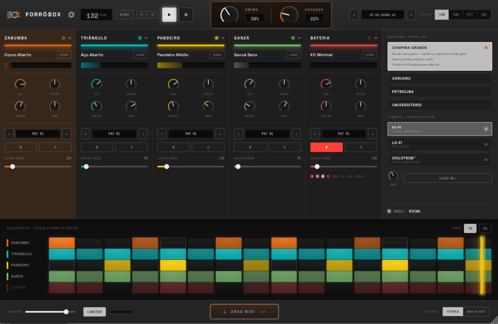
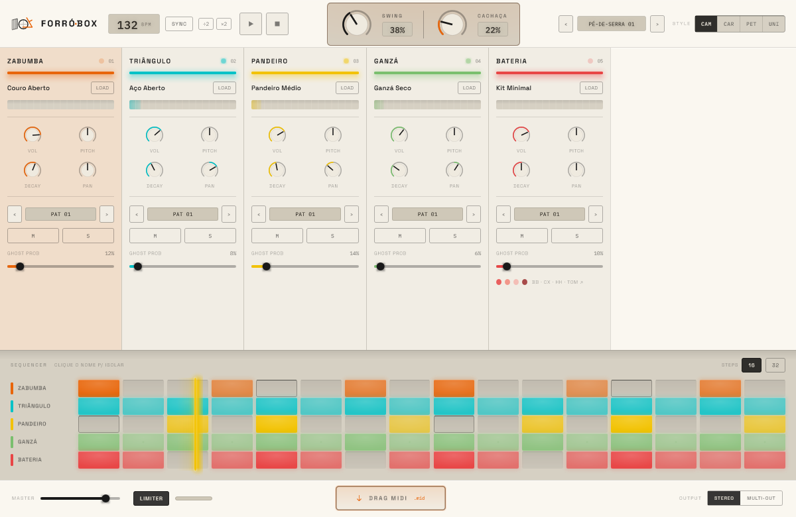

<div align="center">

# Forró Box

**A VST3 instrument for Brazilian _forró_ percussion.**

Five-channel step sequencer · four regional groove profiles · `CACHAÇA` humanisation · synthesised voices

JUCE 8 · C++20 · Linux + Windows · GPLv3



</div>

---

## What it is

A drum machine for forró — the northeastern Brazilian dance music built on **zabumba**, **triângulo**
and **pandeiro**. It is a step sequencer with five instrument channels, per-step velocity, ghost
notes, swing, and a humanisation control that makes a programmed groove breathe like a played one.

The thing it is actually *for* is the last part. A forró groove that lands exactly on the grid does
not sound like forró. `CACHAÇA` is one knob that introduces timing jitter, velocity variation and
ghost notes together — and every value it produces is a **keyed hash** of `(seed, step, lane,
purpose)` rather than a draw from a random stream, so muting one channel cannot re-time another and
the same seed always gives the same performance.

### Status

In development. The engine and the interface are real, tested and audible; some controls are
deliberate stubs. Honest breakdown:

| | |
|---|---|
| ✅ **Voices** | Eight — seven synthesised, zabumba from three measured velocity layers |
| ✅ **Sequencer** | Sample-accurate clock, swing, host sync with step 0 locked to the bar |
| ✅ **`CACHAÇA`** | Timing jitter, velocity variation, ghost notes; keyed, not drawn |
| ✅ **Output** | Character bus (HI-FI / LO-FI / CICLOTRON™), limiter, squared-taper master |
| ✅ **Multi-out** | Six VST3 buses — the full mix plus one stereo stem per channel |
| ✅ **Interface** | Full chassis, both themes, 1× / 1.5× / 2×, every control hand-drawn |
| ✅ **Grid** | Five rows, 16/32 steps with tiling, click to edit, playhead, per-channel LEDs and meters |
| ✅ **State** | Lossless save/reload, hardened against malformed project data |
| 🚧 **Profiles** | The four groove tables exist and play; `STYLE` and the profile field are drawn but **inert** |
| 🚧 **Bateria kit** | The row edits caixa; the four-piece overlay is not built |
| ⬜ **MIDI** | No export, no drag-out, no live MIDI out yet |

**A fresh instance opens with an empty grid.** Click pads in to hear it — profile loading is the next
phase.

<div align="center">

<br><em>The light theme is a deliberate differentiator, not an afterthought.</em>
</div>

## Building

CMake 3.22+, a C++20 compiler, and JUCE 8.

```bash
cmake -B build-linux -DCMAKE_BUILD_TYPE=Release -DJUCE_PATH=/path/to/JUCE
cmake --build build-linux -j
```

Omit `JUCE_PATH` and CMake fetches JUCE itself. The VST3 lands in
`build-linux/ForroBox_artefacts/Release/VST3/`.

**Windows:** `scripts/build-windows.sh` builds natively with MSVC through WSL interop and installs to
the host's VST3 folder, discovered from the host's own scanner record rather than assumed.
`FORROBOX_MSVC_JOBS` caps MSBuild's width on a memory-constrained machine.

## Tests

```bash
cmake --build build-linux --target ForroBoxTests && ./build-linux/ForroBoxTests
```

**3313 checks**, green under GCC, Clang and MSVC. They run **headless** — the UI tests render into a
`juce::Image` with `DISPLAY` unset — so there is no display dependency and no golden-image drift.

Three things about how this project tests are worth knowing, because they shaped the code more than
any feature did:

**Every measurement instrument is self-tested.** Twelve audio measurements were wrong before the code
was. So every instrument in `TestHarness.h` is first proved against a synthetic signal with a known
answer, *including a case it must reject*. Two UI instruments shipped unable to report the difference
they existed to measure — a pixel comparison whose `getbbox()` read an all-zero alpha channel as
empty, and a glow check that counted "equal" as a descent — and both were found this way.

**A green suite proves nothing about a check that cannot fail.** Every claim is mutated in a
throwaway copy of a committed tree and the mutation must be *detected* — a build failure is not a
detection, and the real exit code is read rather than a pipeline's. Roughly two dozen checks that
could not fail have been found and fixed this way.

**The design is cross-checked against its source, not transcribed from it.**

```bash
python3 scripts/verify-theme.py      # colour tokens, both themes
python3 scripts/verify-geometry.py   # 152 lengths + 50 type-scale values
python3 scripts/verify-profiles.py   # the groove tables, against data.js
```

These read `forrobox.css`, `controls.js`, `app.js` and `data.js` directly and fail the build on any
divergence. A wrong digit in a groove table is not a crash and not a failed test — it is a groove
that is subtly wrong with no way to know which digit.

## How it is built

```
src/
  PluginProcessor.*     the processor: parameters, state, bus layout, the block
  Clock.*               position-driven step clock; swing; host sync
  VoiceEngine.*         the voice pool, per-lane keyed humanisation
  Voices.*              seven synthesised percussion voices
  ZabumbaSampler.*      three measured velocity layers
  MixBus.*              character bus, limiter, master
  PatternSnapshot.*     lock-free pattern handover to the audio thread
  StepSnapshot.*        group-atomic step publication back to the UI
  Chassis.*             the 1200×780 chassis and its five channel strips
  SequencerGrid.*       the pad grid, playhead, STEPS
  Knob/Fader/Button/…   every control, hand-drawn from the prototype's own source
```

Three constraints govern the architecture:

- **`processBlock` allocates nothing and takes no lock.** Verified by an allocation counter, not by
  inspection. The only lock the audio thread touches is a try-lock it never waits on.
- **The pattern grid is state, not parameters.** 256 grid values must not become automation lanes, so
  they live in the APVTS `ValueTree` and reach the audio thread through a lock-free handover.
- **Every writer publishes automatically.** State is reachable only through an RAII handle that
  publishes from its destructor — "every writer must remember" is the invariant that fails, and this
  project has the commit history to prove it.

## The prototype

`Forró Box (standalone).html` is a working HTML/CSS/JS prototype and the **design source of truth**.
The plugin is a native reimplementation, not a port: correct plugin practice wins wherever the two
conflict, and the conflicts are recorded where they were decided.

Open it in a browser and play it beside the plugin. Its own notes are in
[`docs/README-prototype.md`](docs/README-prototype.md).

## Licence

**GPLv3** — see [`LICENSE`](LICENSE). This matches JUCE's own open-source terms; a permissive licence
here would not change what a binary built against GPL JUCE inherits.

[`NOTICE.md`](NOTICE.md) records what the project licence does not cover: JUCE itself, the two OFL
fonts, and the samples.

## Credits

Forró Box is made by **Carlos Eduardo Batista** ([npiq.cc](https://npiq.cc/)) and
**Esmeraldo Filho** ([chicocorrea.bandcamp.com](https://chicocorrea.bandcamp.com/)) —
see [`ABOUT.md`](ABOUT.md).

Zabumba samples recorded and provided by Esmeraldo Filho, who records as **Chico Corrêa** —
[soundcloud.com/chicocorrea](https://soundcloud.com/chicocorrea).

Fonts: **Space Grotesk** and **IBM Plex Mono**, both under the SIL Open Font License.
